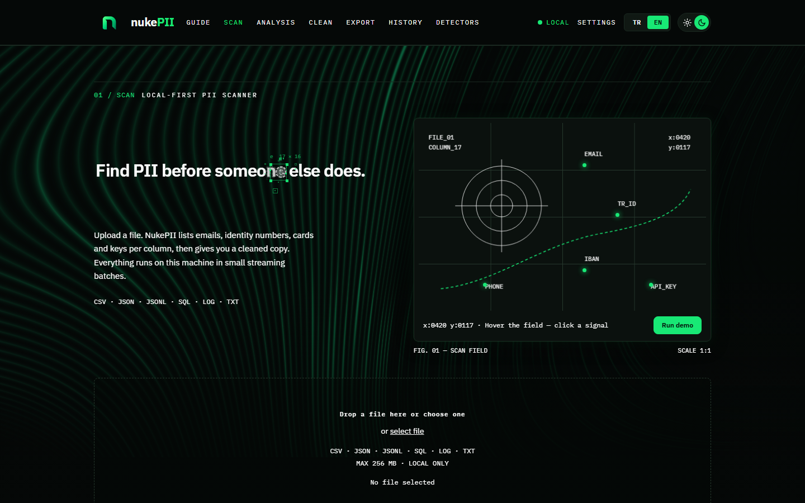
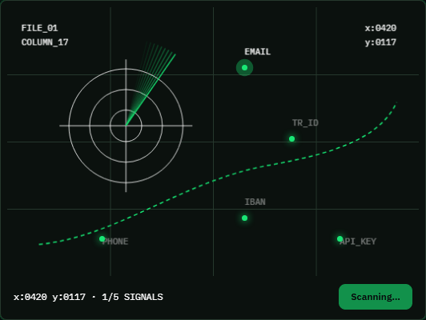
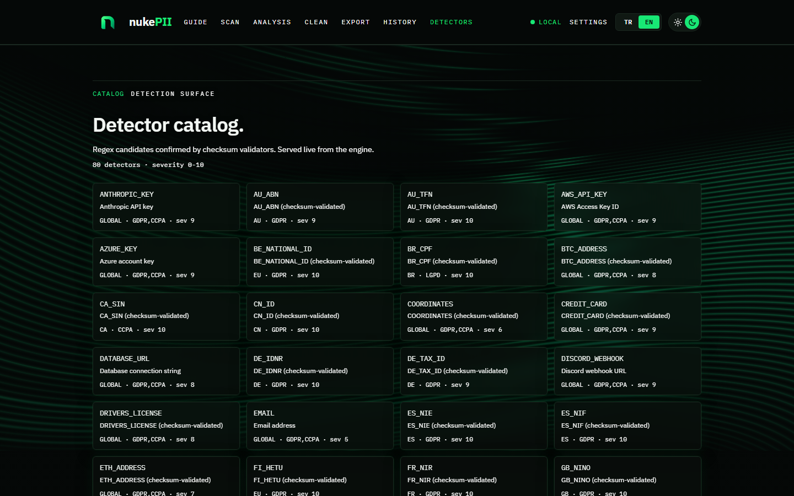
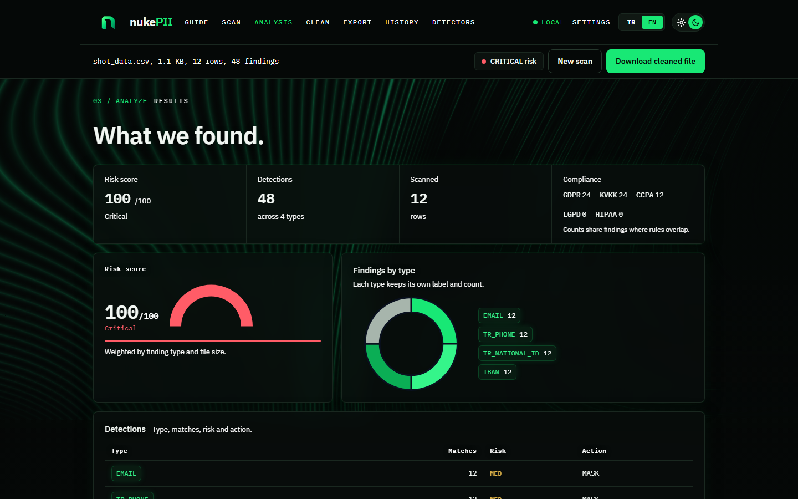

# NukePII

Zero-trust, local-first PII detection, analysis and sanitization engine.
80 detectors across 23 regions (TR, US, EU, GB, FR, DE, IT, ES, PL, BR, IN,
AU, CA, CN, KR, SG, IL, ZA, TH, TW, HK, JP) covering national IDs, finance,
health, crypto, secrets, network identifiers and geo pairs. Regex candidates
confirmed by checksum validators. Your files never leave the machine.




## Highlights

- **80 detectors** (`nukepii/core/detectors`): national IDs with Mod10/11,
  Luhn, Verhoeff, ISO 7064 and MOD 97 checks; credit cards, IBAN, JWT,
  cloud API keys (AWS, GCP, GitHub, OpenAI, Anthropic, Stripe, ...),
  webhooks, private keys, database URLs, MAC/IMEI, VIN, ISIN, crypto
  addresses, coordinates, MRZ passports. Standard library only.
- **Sanitizers** (`nukepii/core/sanitizers`): mask (format-preserving),
  redact, HMAC hash, pseudonymize, vault tokenize, FPE and
  differential-privacy noise for numerics.
- **Streamer** (`nukepii/core/streamer`): bounded-memory scanning of
  CSV / JSON / JSONL / SQL / LOG / TXT / MD via Polars, Pandas, stdlib
  fallback. 256 MB upload cap, chunked rows, parallel workers.
- **Web UI**: dark/light themes, TR/EN language, interactive scan field
  (hover tooltips, pinned signals, demo sweep), risk gauge, donut and
  heatmap charts, history kept in the browser only.
- **REST + job API**: one-shot `/api/scan`, `/api/clean`, `/api/report`
  plus job-oriented `/api/v1/*`; OpenAPI spec at `/api/openapi.json`,
  interactive docs at `/api/docs`.
- **CLI + SDK + SARIF**: `nukepii scan/clean/scan-dir`, stdlib-only
  Python client, SARIF export for code scanning.

## Quickstart

```bash
pip install -e .
nukepii scan --file data.csv
```

Start the web UI:

```bash
make run                             # http://127.0.0.1:5000
# or
python nukepii/web/app.py
```

Drop a file on the scan page, inspect the masked preview, open the
analysis report, then download the cleaned copy. Raw PII is never shown
unless you explicitly opt in with `NUKEPII_ALLOW_RAW=1` + `preview=raw`.



## Web UI

| Page      | Route        | What it does                                              |
|-----------|--------------|-----------------------------------------------------------|
| Scan      | `/scan`      | Drag-and-drop upload, mode/region/salt, live scan readout |
| Analysis  | `/analysis`  | Risk gauge, breakdown donut, heatmap, masked diff preview |
| Clean     | `/clean`     | Sanitization workspace, cleaned file download             |
| Export    | `/export`    | JSON report and cleaned file export                       |
| History   | `/history`   | Past scans, browser-local only                            |
| Detectors | `/detectors` | Full catalog rendered live from the engine                |
| Guide     | `/guide`     | Five-step workflow overview                               |
| Settings  | `/settings`  | Theme, language, region, default mode                     |



## REST API

One-shot endpoints (multipart `file` field):

| Method | Endpoint       | Notes                                              |
|--------|----------------|----------------------------------------------------|
| GET    | `/api/health`  | Liveness probe, engine info                        |
| POST   | `/api/scan`    | `mode`, `region`, `salt`, `preview` → JSON report  |
| POST   | `/api/clean`   | `mode`, `region`, `salt` → sanitized file download |
| POST   | `/api/report`  | `format=html\|pdf` → audit report                  |
| GET    | `/api/openapi.json` | Machine-readable contract                     |
| GET    | `/api/docs`    | Interactive API docs                               |

Job-oriented API under `/api/v1/*`:

```bash
SID=$(curl -s -F file=@data.csv http://127.0.0.1:5000/api/v1/scan | jq -r .scan_id)
curl http://127.0.0.1:5000/api/v1/scan/$SID/result
curl -X POST -H 'Content-Type: application/json' \
  -d "{\"scan_id\":\"$SID\",\"mode\":\"mask\"}" \
  http://127.0.0.1:5000/api/v1/clean -o clean.csv
```

Scan modes: `mask` (default), `hash`, `redact`, `pseudonymize`, `noise`
(numeric fields; falls back to mask for strings), `vault`, `fpe`.
Regions: `ALL` (default), `TR`, `US`, `EU`, `GB`, `FR`, `DE`, `IT`, `ES`,
`PL`, `BR`, `IN`, `AU`, `CA`, `CN`, `KR`, `SG`, `IL`, `ZA`, `TH`, `TW`,
`HK`, `JP`.

## CLI

```bash
nukepii scan --file data.csv --region TR --mode mask
nukepii scan --file data.csv --format sarif > report.sarif
nukepii clean --file data.csv --mode pseudonymize --salt my-salt
nukepii scan-dir --dir ./data --pattern "*.csv" --fail-on HIGH
nukepii engines     # streaming backend availability
nukepii openapi     # print the HTTP API contract
```

Python SDK (standard library only):

```python
from nukepii.client import NukePIIClient
client = NukePIIClient("http://127.0.0.1:5000")
report = client.scan_file("data.csv", mode="mask", region="ALL")
print(report["risk_score"], report["total_detections"])
```

## Zero-trust notes

- Files are streamed to a temp file and scanned line by line; nothing is
  kept in RAM and temp files are unlinked in `finally` blocks.
- API responses carry `Cache-Control: no-store`; file contents are never
  logged; filenames go through `secure_filename` plus an allowlist.
- Safe preview is the default: the UI shows masked excerpts only.
- `nukepii_vault.db`, `*.nukepii.*` exports and scan targets are git-ignored
  and must never be committed (see `.gitignore`).

## Deploy

```bash
docker compose up --build -d
curl http://127.0.0.1:5000/api/health
```

The image serves the app with waitress (single process, 8 threads) as
non-root user `nukepii`, with a container healthcheck on `/api/health`.
Single process is deliberate: `/api/v1` job state lives in-process.
Environment knobs:

| Variable            | Default     | Notes                                              |
|---------------------|-------------|----------------------------------------------------|
| `NUKEPII_HOST`      | `127.0.0.1` | Compose/Dockerfile set `0.0.0.0`                   |
| `NUKEPII_PORT`      | `5000`      | Container listens on this port                     |
| `NUKEPII_ALLOW_RAW` | unset       | Set `1` only to enable `preview=raw` (not advised) |
| `NUKEPII_DEBUG`     | unset       | Set `1` for the Flask debugger (never in prod)     |

No volumes are mounted by default, so uploads stay inside the container
and die with it. To scan host files, mount read-only (see the commented
example in `docker-compose.yml`). Put a reverse proxy with TLS and a
request-size limit in front for public exposure.

## Environment Variables Setup

NukePII keeps no secrets in code. All configuration flows through
environment variables (read with `os.getenv`, standard-library only —
no dotenv dependency). Test fixtures that look like tokens are synthetic
vectors the detectors are supposed to catch, never credentials.

**1. Copy the template and fill in your values:**

```bash
cp .env.example .env        # Windows (PowerShell): Copy-Item .env.example .env
```

`.env` is git-ignored (`.env.example` stays tracked as the template).
For shells, export the variables instead:

```bash
export NUKEPII_VAULT_KEY="$(python -c "import secrets; print(secrets.token_hex(32))")"
```

**2. Reference:**

| Variable            | Default       | Notes                                             |
|---------------------|---------------|---------------------------------------------------|
| `NUKEPII_HOST`      | `127.0.0.1`   | Compose/Dockerfile set `0.0.0.0`                  |
| `NUKEPII_PORT`      | `5000`        | Port the server listens on                        |
| `NUKEPII_MAX_MB`    | `256`         | Max upload size in megabytes                      |
| `NUKEPII_ALLOW_RAW` | unset (`0`)   | Set `1` only to enable `preview=raw` (not advised) |
| `NUKEPII_DEBUG`     | unset (`0`)   | Set `1` for the Flask debugger (never in prod)    |
| `NUKEPII_VAULT_KEY` | ephemeral dev | Vault master key — set per environment in prod    |
| `NUKEPII_VAULT_SALT`| `nukepii-vault-v1` | Stable namespace for vault token derivation  |
| `NUKEPII_NER_MODEL` | unset         | Path to optional ONNX NER model (off by default)  |

**3. Production checklist:** set a unique `NUKEPII_VAULT_KEY` per
environment (back it up — losing it orphans vault tokens), keep
`NUKEPII_ALLOW_RAW`/`NUKEPII_DEBUG` unset, and size `NUKEPII_MAX_MB`
to your reverse proxy's body limit.

## Development

```bash
make lint        # ruff check
make smoke       # stdlib-only smoke test (no fixtures)
make run         # Flask dev server on http://127.0.0.1:5000
make openapi     # export spec to openapi/openapi.json
docker build -t nukepii .          # or: docker compose up
pre-commit install                 # hooks: ruff + whitespace + yaml/json checks
```

CI (`.github/workflows/ci.yml`): lint, OpenAPI contract check, Docker build.

Runtime layout: `nukepii/core/` (detectors, sanitizers, streamer, vault,
fpe, rules), `nukepii/web/` (Flask app, REST + pages), `nukepii/cli/`,
`openapi/`, `docs/screenshots/`. Python 3.12+.
